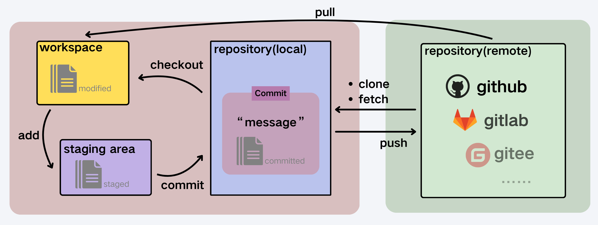

# gitの基本操作
Gitの作業は、プロジェクトのスナップショットを作成・保存し、その後のスナップショットとの比較を行うことです。

Gitでよく使用されるコマンドは、以下の6つあります：

* `git clone`:リモートリポジトリの全内容をローカルマシンにコピーするためのコマンドです。このコマンドを使うことで、他の開発者が作成したプロジェクトを手元に持ってくることができます。
* `git push`: ローカルリポジトリの変更をリモートリポジトリに送信するためのコマンドです。この操作により、自分の変更を他の開発者と共有することができます。
* `git add`: 変更したファイルをステージングエリアに追加するためのコマンドです。このコマンドを実行することで、次回のコミットに含めるファイルを選択することができます。
* `git commit`: ステージングエリアにある変更をローカルリポジトリに保存するためのコマンドです。コミットする際には、変更の内容を説明するメッセージを付けることが一般的です(`git commit -m [message]`)。
* `git checkout`: 主な役割は、ブランチを切り替えたり、特定のバージョンにファイルを戻したりすることです。また、過去のコミット状態に作業ディレクトリを切り替えて、コードを確認やデバッグすることもできます。
* `git pull`: リモートリポジトリの最新の変更を取得し、自分のローカルリポジトリにマージするためのコマンドです。このコマンドを使用することで、他の開発者が行った変更を取り込むことができます。
 
 
## よく使うコマンドの早見表

### 基本操作

| コマンド(一般的な使い方) | 説明                                                       |
| :------------------------- | :----------------------------------------------------------- |
| `git init`                         | 新しいGitリポジトリを作成し、ディレクトリを初期化します。  |
| `git clone [url]`                         | リモートリポジトリをローカルにコピーします。               |
| `git add [file]/[dir]/.`                         | 指定したファイルやディレクトリをステージングに追加します。 |
| `git commit -m [message]`                         | ステージされた変更をリポジトリにコミットします。           |

### 状態確認

| コマンド(一般的な使い方) | 説明                                                 |
| :------------------------- | :----------------------------------------------------- |
| `git status`                         | リポジトリの現在の状態を表示します。                 |
| `git show`                         | 最新のコミットや指定したコミットの詳細を表示します。 |
| `git log`                         | コミット履歴を一覧表示します。                       |
| `git shortlog`                         | 作成者ごとにコミット履歴を簡略表示します。           |
| `git diff [file]`                         | ファイル間の差分を表示します。                       |
| `git blame <file>`                         | ファイルの各行の変更履歴を表示します。               |

### リモート操作

| コマンド(一般的な使い方) | 説明                                             |
| :------------------------- | :------------------------------------------------- |
| `git remote -v`                         | 設定されたリモートリポジトリを表示します。       |
| `git remote add [alias] [url]`                         | 新しいリモートリポジトリを追加します。           |
| `git fetch [alias]`                         | リモートリポジトリの更新をダウンロードします。   |
| `git pull`                         | リモートの変更を取得し、ローカルにマージします。 |
| `git push [alias] [branch]`                         | ローカルブランチをリモートにアップロードします。 |

### 削除と取り消

| コマンド(一般的な使い方) | 説明                                                                 |
| :------------------------- | :--------------------------------------------------------------------- |
| `git reset HEAD~[num]`                         | コミット履歴を指定した数だけ戻し、変更をステージングから解除します。 |
| `git rm <file>`                         | ファイルをリポジトリから削除し、次のコミットで追跡対象から外します。 |
| `git checkout -- <file>`                         | ファイルを最新のコミット状態に戻します。                             |

### ブランチ操作

| コマンド(一般的な使い方) | 説明                                                 |
| :------------------------- | :----------------------------------------------------- |
| `git branch -a`                         | すべてのローカルおよびリモートブランチを表示します。 |
| `git branch [branch-name]`                         | 新しいローカルブランチを作成します。                 |
| `git branch -d [branch-name]`                         | マージ済みのローカルブランチを削除します。           |
| `git switch -c [branch-name]`                         | 新しいブランチを作成し、切り替えます。               |
| `git switch [branch-name]`                         | 既存のブランチに切り替えます。                       |
| `git merge [branch-name]`                         | 指定ブランチの変更を現在のブランチにマージします。   |