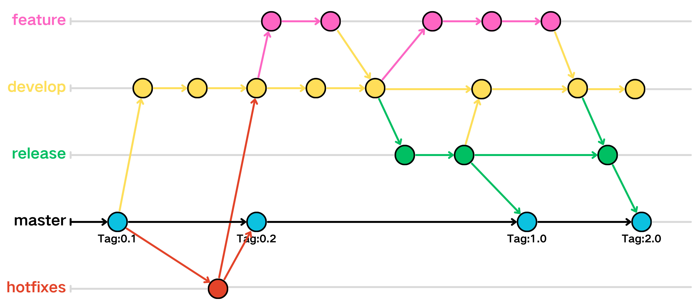
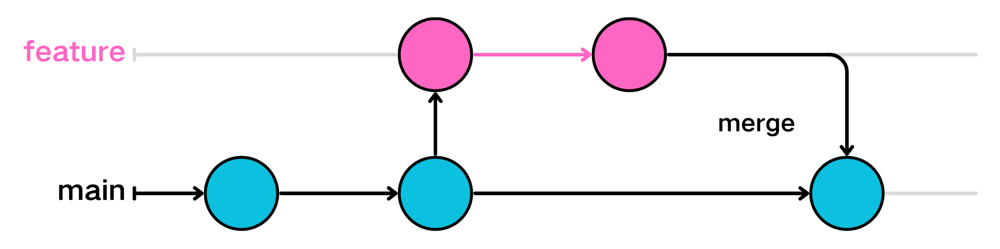
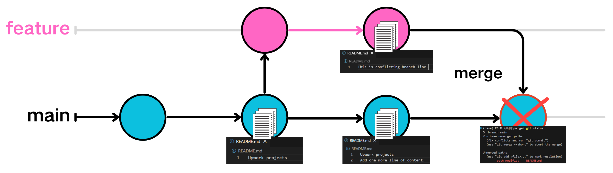

# フランチの使用方法

Gitのブランチ管理は、Gitの強力な機能の一つであり、複数の開発者が並行して作業を行い、新機能の開発、バグの修正、または実験を行うことができ、主コードベースに影響を与えません。

ほとんどすべてのバージョン管理システムは、何らかの形でブランチをサポートしており、ブランチは独立した開発ラインを表します。

ブランチを使用することは、開発のメインライン（master/main）から分離して、メインラインに影響を与えることなく作業を続けることができることを意味します。
 
  
## ブランチの作成

次のコマンドを使用して新しいブランチを作成し、そのブランチに切り替えることができます：
```
git checkout -b <branchname>
```
<branchname>は自由に定義できます。正式な開発では通常、確かな意味を持つ固定名称（例えば、developは開発ブランチ、featureは新機能ブランチ）を使用する一般的。

このコマンドは、ブランチの作成とブランチへの切り替えの2つのコマンドを組み合わせたコマンドです。

ブランチを切り替えるコマンド：
```
git checkout <branchname>
```
> [!TIP]
> checkoutコマンド自体には他の用途もあるため、新しいバージョンのgitでは、以下の2つのよりシンプルなコマンドを使用してブランチを作成および切り替えることもできます
> ```
> git switch -c [branch-name]
> git switch [branch-name]
> ```
 
 
## マージ

他のブランチを現在のブランチにマージするコマンド：
```
git merge <branchname>
```
`git merge` コマンドを使用してブランチをマージした後、マージされたブランチは消えません：

マージ操作は、マージされるブランチの変更を現在のブランチに統合しますが、元のマージされたブランチはそのまま残ります。そのブランチは引き続き使用して、他の操作や修正を行うことができます。
 
### マージコンフリクト
ブランチをマージした際にコンフリクトが発生すると、次のような形式のエラーメッセージが表示されます：
```
(base) PS D:\Desktop\merge> git merge feature
Auto-merging README.md
CONFLICT (content): Merge conflict in README.md
Automatic merge failed; fix conflicts and then commit the result.
```
これは、現在のブランチとマージしようとしているブランチで、同じファイルの同じ箇所に異なる変更があったため、Gitがどの変更を保持すべきか判断できなかったことが原因です。

このような状況に直面した場合、`git status` を使用して競合しているファイルを見つけ、手動で競合部分を修正することができます。

> [!TIP]
> VSCodeのGit機能やGUIのGitツールなどのツールを利用することで、競合をより直感的に修正することができます。
 
#### いつマージコンフリクトが発生しますか？:
* 2つのブランチで同じファイルの同じ部分が異なる内容に変更されていると、Gitはどちらの変更を優先するべきか判断できないため、コンフリクトが発生します。
* 一方でファイルが削除され、もう一方でそのファイルに変更が加えられていると、どの操作を採用すべきか不明なためコンフリクトが発生します。
* 複数の開発者が同じファイルやコード部分を並行して編集し、その後ブランチをマージしようとすると、コンフリクトが発生しやすくなります。
