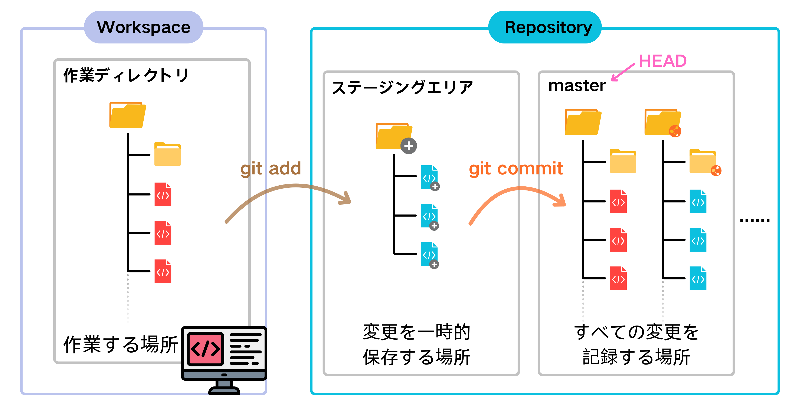
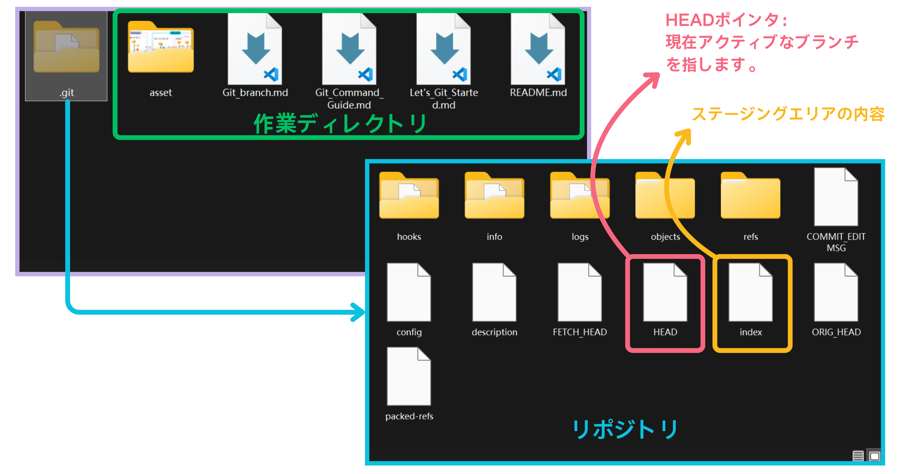
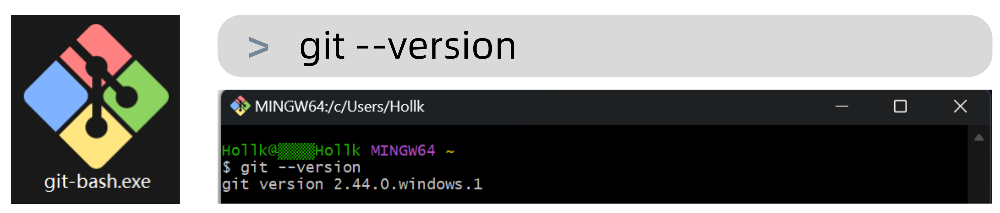
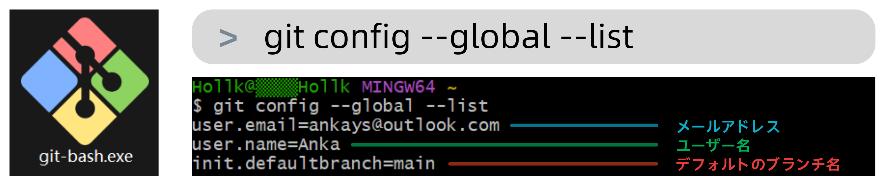
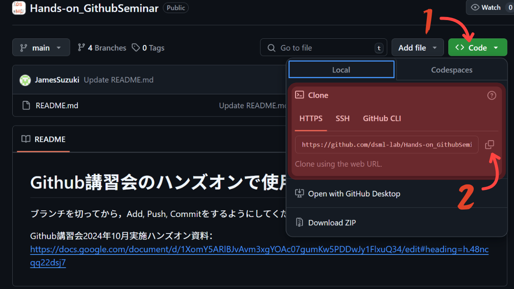
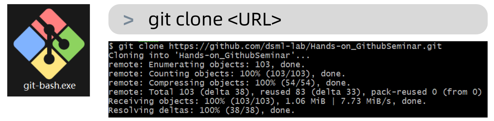
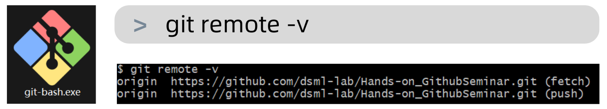
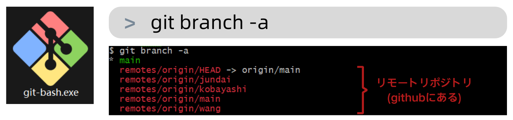

[](https://git-scm.com/)
## gitとは
Gitは現在最も主流な分散型バージョン管理システムです。その核心機能はファイルのバージョン管理、仕事のあらゆる変更履歴が記録・管理にあります。
また、Gitは遠隔地にいる複数人での共同編集をサポートしており、チームプロジェクト開発に欠かせない基盤となっています。そのため、Gitはプログラマーにとって必須のスキルでもあります。
**特徴：**
- オープンソースで無料、広く使われている。
- 差分ではなく完全なスナップショット（完全な内容）を直接記録する。
- 分散型の複数人でのコード協同開発をサポートし、ほとんどの操作がローカルで実行されるため、コードのマージや同期が可能。
- シンプルで使いやすいブランチ管理を提供し、効率的にブランチを作成・マージできる。
<br>

### Gitの概念とよく使われる専門用語
| 概念名称                              | 説明                                                                                                                                            |
| --------------------------------------- | ------------------------------------------------------------------------------------------------------------------------------------------------- |
| 作業ディレクトリ（Workspace）         | パソコン上で見えるコードベースのディレクトリで、作業する場所。新規ファイルや変更されたファイルは、一時的にステージングエリアに送られる。        |
| ステージングエリア（stage）           | ファイルの変更を一時的に保存する場所。実際には `.git/index` というファイルで、コミット待ちのファイルリスト情報を保存している。                              |
| リポジトリ（Repository）              | Gitの管理倉庫。バージョンのデータベースを管理し、ファイルやディレクトリの状態を記録する場所。すべての変更履歴（バージョン）はここに保存される。 |
| サーバー/リモートリポジトリ（remote） | サーバー側のリポジトリで、専用のGitサーバー。他者と共有するための役割を持ち、ローカルリポジトリからpushコマンドでコードを送信できる。           |
| ローカルリポジトリ                    | ユーザーのPC上で直接使用されるリポジトリ。                                                                                                      |
| ブランチ（Branch）                    | ブランチは、メインラインから分岐した「コピー」で、独立して操作できる。リポジトリを初期化すると、デフォルトのメインブランチ `master` が作成される。      |
| HEAD                                  | HEADは「ポインタ」のようなもので、現在アクティブなブランチの最新バージョンを指している。                                                        |
| コミット（Commit）                    | ステージングエリアにあるすべての変更内容を、現在のリポジトリのアクティブブランチに反映させること。                                              |
| プッシュ（Push）                      | ローカルリポジトリのバージョンをサーバー（リモート）リポジトリに送信し、他のユーザーと共有すること。                                            |
| プル（Pull）                          | サーバー（リモート）リポジトリから最新の変更をローカルリポジトリに取得し、他のユーザーの共有内容を取り込むこと。                                |
| フェッチ（Fetch）                     | サーバー（リモート）リポジトリから更新を取得するが、自動でマージはしない点がプルとの違い。                                                      |
| コンフリクト（Conflict）              | 複数のユーザーが同じファイルを編集し、それをリポジトリにマージしようとするときに発生する衝突。手動での解決が必要。                              |
| マージ（Merge）                       | コンフリクトのあるファイルをマージする操作。Gitは自動的に変更内容をマージし、手動での解決が必要な部分については通知される。                     |
| タグ（Tags）                          | ブランチの特定の時点の状態を示すもの。コミット履歴の別名として使用され、バージョンをマークする際に用いられる。                                  |
| master（またはmain）                  | リポジトリの `master` ブランチで、デフォルトのメインブランチ。リポジトリの初期化時に作成される。Githubではデフォルトのブランチ名は `main` 。                  |
| origin/master                         | リモートリポジトリ（origin）の `master` ブランチを指す。                                                                                                |
| origin/HEAD                           | リモートリポジトリ（origin）の最新のコミットの位置を指す。通常は `origin/master` と一致する。                                                                  |
<br>
 
### 作業ディレクトリ、ステージングエリア、リポジトリ
Gitでは、作業を管理する際に「作業ディレクトリ」「ステージングエリア」「リポジトリ」という3つの重要な領域があります。



- **作業ディレクトリ（Workspace）：**
  - コンピュータ上で確認できるコードベースのディレクトリで、ファイルを新規作成したり、変更や削除を行う場所です。
  - `git add` コマンドを使用して、作業ディレクトリの変更をステージングエリアに保存します。
- **ステージングエリア（stage）：**
  - ファイルの変更を一時的に保存するための場所です。
  - `.git/index` ファイルで、コミット予定のファイルのリスト情報を保持しています。
  - `git commit` コマンドを使用して、ステージングエリアの内容を正式にリポジトリにコミットします。
- **リポジトリ（Repository）：**
  - Gitの管理倉庫であり、バージョンを管理するためのデータベースです。
  - ファイルやディレクトリの状態の記録がここで行われ、すべての変更履歴（バージョン）はここに保存されます。
  - 作業ディレクトリの下にある隠しフォルダ `.git` がリポジトリであり、ステージングエリアやブランチ、履歴情報などが含まれます。
  
<br>

## gitのインストール
git公式からダウンロード：<https://git-scm.com/downloads>
ここではインストール手順を省略します。具体的な手順は[スライド](https://dsml-tdu.slack.com/files/U7DQMP0BF/F065E6L5483/d___git___by______2010___.pdf)の_pp.30-38_を参照してください。

インストール完了後、Git Bashを開き、`git --version`と入力してバージョンとインストール状況を確認します。

<br>

### gitコマンドの設定
インストール完了後、最初に行うべきことは、ユーザー名とメールアドレスを設定することです。（必ず設定を行ってください。じゃないと`commit`を行うことができません。）
```
git config --global user.name "<Your Name>"
git config --global user.email "<your.email@example.com>"
```


> [!Note]
> Gitはオープンソースプロジェクトであり、複数の開発者が共同作業を行う際には、メールを通じてコミュニケーションをとることがよくあります。user.nameとuser.emailを設定することで、このコミットが誰によって行われたのか、またその連絡先を他の人に伝えることができます。
> 最近GitHubのようなプラットフォームがメールやユーザー名の重要性を薄めていますが、コミットにおいてコミッター自身の身元を指定することは依然として重要です。
<br>

## 最初のリポジトリを立てる
GitHubのリモートリポジトリから[サンプルプロジェクト](https://github.com/dsml-lab/Hands-on_GithubSeminar)のHTTPSを取得し、`git clone`コマンドを使用してローカルにコピーします。


> [!TIP]
> このプロジェクトはリモートからコピーされるため、再作成は不要ですが、ローカルで新しいリポジトリを作成する場合、`git init`を実行する必要があります。
`clone`が完了したら、まずプロジェクトフォルダー（隠しフォルダー`.git`があるディレクトリ）に移動する必要があります。
```
cd Hands-on_GithubSeminar
```
これでローカルにGitリポジトリの作成が完了しました。  
<br>

ちなみに、このリポジトリはGitHubのリモートリポジトリから来ているため、Gitは自動的にリモートリポジトリの接続を設定し、`origin`という名前が付けられます。  

さらに、`git branch -a`を使用すると、ローカルのメインブランチ（`main`）に加えて、リモートリポジトリの各ブランチも表示されます。

> [!TIP]
> 初期ブランチのデフォルト名としてmainを使用することをお勧めします。これは、GitHubのメインブランチがこの名前を使用しているためです。設定方法はgit config --global init.defaultBranchコマンドを使用して行うことができます。
